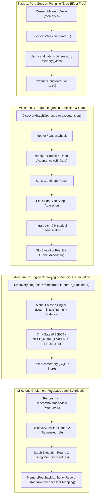

# Astra Batch Discovery & Memory Feedback Specification

> **Issue #502 Stage 2 Specification (Milestones B, C, D)**
> 状态：**Stage 2 核心交付完成，待付哥 Stage 2 复核** | 模式：`research-json-v1` SHA-256 Canonical Digest | Fail-Closed

本文档定义 Research Lab 下 Astra 批量候选发现（Batch Discovery Execution）、执行端范围准入（Execution-Side Scope Admission）、工程状态隔离、重放幂等、确定性去重、两轮记忆闭环（Two-Round Memory Feedback Loop）以及可信归因审计契约。

---

## 1. 契约架构与职责定位



### 1.1 核心原则与硬边界
1. **纯规划无副作用保持**：`DiscoverySession` 和 `plan_candidate_slots` 保持纯函数式无副作用；执行、重放、路由和调度由独立执行编排器 `DiscoveryBatchOrchestrator` 拥有。
2. **一个槽位独立执行**：每个槽位严格对应一个 `AlphaGenerationRequest / AgentTask / provider work block`（`requested_candidate_count = 1`）。严禁让 LLM 单次返回 10 个候选，不自造 Provider 调用池或后台工作队列。
3. **单槽位工程隔离**：任意单个槽位的路由失败、配额耗尽、网络异常、解析失败或范围不符，按槽位记录工程状态（`SlotEngineeringStatus`），不中断整个批次，不丢失其余槽位结果。
4. **M8 状态门禁**：仅当 Provider/Transport 达到已接受的终态（`ACCEPTED / COMPLETED`）时方可进入 candidate admission；`RUNNING / UNKNOWN / FAILED` 或空响应严禁冒充成功。
5. **重放幂等与重试有界**：默认每槽位一个 attempt；同 attempt 重放通过执行缓存与身份校验实现幂等（`is_replayed=True`），零重复计数与零重复科学写入。
6. **科学身份与去重客观性**：去重基于确定的语义哈希（`scientific_identity_hash`）与参数结构键（`compute_structured_key`），不采信模型自报的重复/新颖声明。`duplicate` 不跳过执行与漏斗统计，`failed approach` 不做永久黑名单。
7. **隔离与非目标**：Lab 永久保持 `production=False`, `is_tradable=False`, `live_trading_authorized=False`, `countable_forward=False`。严禁引入嵌套代理（nested agents）或外部爬虫。

---

## 2. 执行端范围准入（Scope Admission）

在 Stage 1 中，Session 约束仅投影在 Prompt 中；Stage 2 严格补齐执行端强制范围准入（`admit_alpha_generation_output` fail-closed）：

| 检查维度 | 准入要求 | 违规工程状态 | 失败说明 |
|---|---|---|---|
| **Universe** | 必须属于显式授权的 `allowed_universe`（如 `("RB", "HC")` 或 `("RB2405",)`）；任何无受控展开的别名（如 `commodity_active`, `all_futures`, `equities`, `crypto`）均被 fail-closed 强行拒绝（抛出 `AlphaGenerationError`）。严禁股票（`AAPL`）、加密货币（`BTC`）或非法/未知标的 | `SCOPE_MISMATCH` | `candidate universe '...' is not in allowed_universe` 或 `has no controlled expansion` |
| **Frequency** | 候选假说的 `frequency` 必须规范化后精确匹配 Session 的 `allowed_frequency`（如 `1d`） | `SCOPE_MISMATCH` | `candidate frequency '...' does not match allowed_frequency` |
| **Signal Family** | 若 Session 设定了 `allowed_signal_families`，假说 `signal_family` 必须属于其白名单集合 | `SCOPE_MISMATCH` | `candidate signal_family '...' not in allowed_signal_families` |
| **Memory Context** | 候选声明的 `source_context_refs` 必须为当前绑定的 `ResearchMemoryView` 内真实存在的 `entry_id` 的严格子集 | `ADMISSION_FAILED` | `source_context_refs contains a reference outside the bound Memory View` |
| **Session 绑定** | 实际执行前比对 Session、Slot、Request、Task 与 Memory View 的身份哈希（`snapshot_hash`）及跨 Session/View/Attempt 校验 | `ADMISSION_FAILED` | 跨 Session、跨 View 或快照不一致立即 fail-closed 阻断 |

---

## 3. 槽位工程状态与结果结构

### 3.1 SlotEngineeringStatus 枚举
```python
class SlotEngineeringStatus(str, Enum):
    COMPLETED = "COMPLETED"                    # 成功完成并通过全部准入检查
    ROUTING_FAILED = "ROUTING_FAILED"          # Provider 无可用路由
    QUOTA_EXHAUSTED = "QUOTA_EXHAUSTED"        # 配额耗尽
    AGENT_EXECUTION_FAILED = "AGENT_EXECUTION_FAILED"  # Provider 执行报错
    PROVIDER_UNCERTAIN = "PROVIDER_UNCERTAIN"  # Provider 结果状态不确定
    RESULT_NOT_ACCEPTED = "RESULT_NOT_ACCEPTED"# M8 结果验收拒绝
    PARSE_FAILED = "PARSE_FAILED"              # 输出严格 JSON/信封解析失败
    ADMISSION_FAILED = "ADMISSION_FAILED"      # 记忆上下文校验失败
    SCOPE_MISMATCH = "SCOPE_MISMATCH"          # 标的/周期/族等范围不符
    NOT_ATTEMPTED = "NOT_ATTEMPTED"            # 批次被配额熔断或未调度
```

### 3.2 SlotExecutionResult 契约
```python
@dataclass(frozen=True)
class SlotExecutionResult:
    session_id: str
    slot_id: str
    ordinal: int
    attempt: int
    engineering_status: str                   # SlotEngineeringStatus.value
    error_code: str | None = None
    error_message: str | None = None
    candidate: AlphaGenerationCandidate | None = None
    duplicate_status: str | None = None       # "EXACT_DUPLICATE" | "RELATED_HISTORY" | "NOVEL_WITHIN_VIEW" | "NOT_CHECKED"
    duplicate_refs: tuple[str, ...] = ()
    duplicate_status_reason: str | None = None# 查重未核验、截断或拒绝时的具体可审计原因
    task_id: str | None = None
    route_id: str | None = None
    provider_job_ref: str | None = None
    provider: str | None = None
    model: str | None = None
    agent_result_id: str | None = None
    agent_result_hash: str | None = None
    hypothesis_id: str | None = None
    hypothesis_content_hash: str | None = None
    scientific_identity_hash: str | None = None
    memory_view_id: str = ""
    memory_view_content_hash: str = ""
    slot_content_hash: str = ""
    is_replayed: bool = False                 # 重放标识

    @property
    def error_details(self) -> dict[str, Any]:
        return {"error_code": self.error_code, "error_message": self.error_message}
```

---

## 4. 真实漏斗分区契约（Funnel Partition Invariants）

批次执行完成后生成 `DiscoveryBatchFunnel`，满足严格的分区恒等式与明确分母：

```python
@dataclass(frozen=True)
class DiscoveryBatchFunnel:
    requested: int                             # 计划槽位数（1..10）
    attempted: int                             # 实际发起尝试的槽位数
    generated: int                             # 成功获得输出的槽位数
    admitted: int                              # 通过契约与范围准入的有效候选数
    invalid: int                               # 解析或范围准入拒绝的槽位数
    provider_failed: int                       # 路由/执行/配额/验收失败的槽位数
    exact_duplicate_count: int                 # 批内或历史完全重复候选数
    related_count: int                         # 批内或历史同族/同目标相关候选数
    novel_count: int                           # 视界内已核验历史且全新候选数
    unverified_count: int                      # 历史记忆未查询或查询失败时的未验证候选数
    signal_families: Mapping[str, int]         # 信号族分布统计
    not_attempted: int = 0                     # 未发起的槽位数（如熔断）
```

### 4.1 分区恒等式与受控历史覆盖原则
1. **槽位终态闭包恒等式**：
   $$\text{requested} = \text{admitted} + \text{invalid} + \text{provider\_failed} + \text{not\_attempted}$$
2. **准入分类完整性恒等式**：
   $$\text{admitted} = \text{exact\_duplicate\_count} + \text{related\_count} + \text{novel\_count} + \text{unverified\_count}$$
3. **分母定义与未查询隔离规则**：
   - `admitted_rate` 分母为 $\text{requested}$。
   - `exact_duplicate_rate`, `related_rate`, `novel_rate`, `unverified_rate` 分母严格为 $\text{admitted}$（仅对已准入候选评估新颖性）。
   - **历史覆盖与新颖性判定的唯一可信路径**：
     - 能认定历史查询已完整覆盖且具备判定 `NOVEL_WITHIN_VIEW` 能力的**唯一路径**，是本批次编排器自身持有 `memory_store`（例如显式绑定 `engine.memory`），通过既有 M4 `build_duplicate_lookup_views` 针对当前 candidate 真实发起的内部受控 exact/related 查询。
     - 外部回调 `duplicate_view_lookup` 不具有证明学术新颖性的能力；因 `ResearchMemoryView` 虽间接哈希 Query 但不直接暴露 Query 对象，外部传入的任何视图均无法证明空查询对象为当前候选。若外部视图未命中确凿重复条目，必须严格 fail-closed 标记为 `NOT_CHECKED`，记录 `duplicate_status_reason = "External duplicate lookup cannot prove novelty; internal memory store query required"`，计入 `unverified_count`（`novel_count = 0`）。
     - **截断视图（`is_truncated=True`）严禁标为全新**：因部分历史条目被截断导致覆盖不全，不能证明候选无历史重复，必须标记为 `NOT_CHECKED` 并记录原因。
   - 禁止将重试次数、尝试计数与最终槽位数混淆。

---

## 5. 两轮记忆反馈闭环（Two-Round Memory Feedback Loop）

Milestone C 验证两轮探索闭环的科学归因：

### 5.1 闭环流程
1. **Round 1 生成**：基于初始受控记忆 $Memory_A$ 创建 $Session_{R1}$，执行 10 槽位批量发现，获得 $Batch_{R1}$。
2. **M6 管道接通**：将 $Batch_{R1}$ 的准入候选逐一传入 `DiscoveryIntegrationOrchestrator`，在 `AlphaDiscoveryEngine` 经过数据切片、确定性回测 Runner 与 `CriticGate` 裁判，生成可追溯的证据事实并存入 `ResearchMemory`。
3. **Memory B 重建**：通过既有 M4 `build_research_memory_view` 入口重新查询 `ResearchMemory`（包含 R1 产生的 `RECENT_REJECTS`、`FAILED_APPROACHES` 等记录），生成携带全新摘要哈希的受控视图 $Memory_B$。
4. **Round 2 生成**：以相同目标、相同约束、相同预算（$candidate\_budget=10$）创建 $Session_{R2}$，注入 $Memory_B$，执行第二轮批量发现。
5. **记忆归因核验**：检查 Round 2 候选是否显式引用 Round 1 产生的具体 Memory Entry（`entry.entry_id`），并产出不可篡改的归因记录。

### 5.2 可信归因记录契约
```python
@dataclass(frozen=True)
class MemoryFeedbackAttributionRecord:
    candidate_id: str                          # Round 2 候选假说 ID
    signal_family: str                         # 信号族
    cited_memory_entry_id: str                 # 引用的 Memory B 条目 ID (rmentry-...)
    cited_decision: str                        # 引用条目的历史裁判结论 (如 NEED_MORE_EVIDENCE / REJECT)
    predecessor_hypothesis_id: str             # 前序失败/gap 假说 ID
    predecessor_failure_or_gap: str            # 前序具体失败原因/证据缺口
    adaptation_description: str                # 本轮假说针对前序失败的具体改进说明
    is_conclusive: bool = False                # 自动流水线在缺少形式化因果验证器前严格保持 False
    scientific_diffs: tuple[str, ...]          # 具体的科学字段差异清单
    field_diffs: tuple[str, ...]               # 全量字段级文本/结构差异清单
```

### 5.3 归因有效性判据与保守审计原则
- **严格限定 Round 1 条目**：归因引用的前序条目必须且仅能映射到 Round 1 通过 Engine/Critic 真实产生的 Memory Record（通过 `r1_records_by_id` 与 `view2_entries_by_id` 严格解析）。
- **客观记录字段与科学差异**：对比 `signal_definition`（规范化去除标点和多余空白后）、`holding_horizon`、`target`、`source_features`、`signal_family` 与 `parameters` 的前后差异，存入 `field_diffs` 与 `scientific_diffs`。
- **Fail-Closed 判定原则（PR #589 P1 纠偏）**：
  - 本自动入口仅客观记录来源与差异清单。
  - 由于当前系统尚未具备完备的形式化因果 gap-to-evidence 证据证明引擎，**所有未有可核验因果证据的归因一律判定为 `is_conclusive = False`**，并在 `adaptation_description` 中明确说明证据不足。
  - 严禁通过关键词/同义词规则推断有效回应缺口；同义改写、标点增减、无关周期/目标变异均保持 `is_conclusive = False`，杜绝伪阳性归因。

---

## 6. PR #589 代码审查专项整改契约（PR 589 Review Fixes）

针对 PR #589 独立 Code Review 提出的 4 项 P1 与 1 项 P2 问题，完成精确落地与闭环验证：

1. **P1 (4068923944) 候选序列化 `to_dict()` 补齐**：`AlphaGenerationCandidate` 增加严格的 `to_dict()` 方法，解决 `slot.to_dict()` 与 `batch.to_dict()` 序列化崩溃问题，确保 JSON 往返一致性。
2. **P1 (4068923949) M3 动态时钟与每槽新鲜快照 Getter**：
   - 批次编排器与反馈循环支持注入 `clock`（动态执行时钟，非固定创建时间）和 `usage_snapshot_provider`（每槽新鲜快照 getter）。
   - 每个新执行槽位在执行时刻根据当前时钟获取最新配额快照并进行 TTL 判龄（>300s 判定过期并拒绝）。
   - Getter 异常隔离为单槽位工程失败（`SNAPSHOT_GETTER_FAILED`），不中断批次运行。
   - 同 attempt 缓存重放直接复用，不重复调用 getter 或重发。
3. **P1 (4068923953) 未决前序 Attempt 联锁互锁**：
   - 执行前严格核查前序 attempt 是否处于 `PROVIDER_UNCERTAIN` / `UNKNOWN`。
   - 严格沿用实际保存的 `_execution_handles`，严禁虚构旧 handle 身份；查询状态异常 fail-closed 拦截，保持 `PRIOR_ATTEMPT_UNRESOLVED` 阻断，仅在确认终态（`CANCELLED/FAILED`）后放行新 attempt。
4. **P1 (4068923957) 归因差异审计与 Fail-Closed 保守判定**：
   - 归因记录区分 `field_diffs` 与 `scientific_diffs`，排除标点符号与格式同义干扰。
   - 自动流水线在缺少可信证据验证器前一律将 `is_conclusive` 设为 `False`，绝不凭关键词猜测或口头声称判定已解决缺口。
5. **P2 (4068923968) 缓存重放动态查重重估**：
   - 命中缓存的重放候选直接复用执行/准入结果，但针对当前动态执行上下文传入的 `prior_admitted` 重新评估去重状态，保持漏斗分类指标客观一致。

---

## 7. 验证与审计结论

- **自动化回归测试套件**：`tests/research_lab/agent_control/test_agent_control_batch_discovery.py` 包含 31 项严密回归测试，全部通过（31 passed）。
- **聚焦测试集全部通过**：Batch Discovery (31) + Discovery Session (18) + Milestone 5 (133) + Milestone 6 (18) + Milestone 8 (42) 共 242 项测试 100% 通过（242 passed）。
- **代码规范与 Diff 检查**：`ruff check` 与 `git diff --check` 严格零报错通过。
- **真实研究数据门禁（Data Gate）状态说明**：
  - **当前状态：`BLOCKED`（未通过）**。
  - **根因**：当前本地工作区仅包含测试用合成数据 `research_lab/tests/fixtures/rb_hc_screening_data.csv`（`provenance="synthetic_lab_screening_data"`）。外部真实 RB/HC 期货日线/分时研究数据集需由 M2 Research Warehouse（`/usr/local/libexec/vnpyresearch`）导出并在快照契约中绑定正式 SHA-256。
  - **准则遵循**：本项目严禁使用 fixture/synthetic 冒充真实研究数据验收。测试 fixture 严格标记为测试产物，在真实研究数据挂载前，数据门禁如实判定为 `BLOCKED`。
- **长期硬边界零触碰**：未修改 `backend/app/execution/**` 或 `backend/app/phase_c/**`，`is_tradable=False`, `production=False`, `live_trading_authorized=False`, `countable_forward=False` 始终严格成立。
